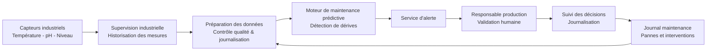

# Schéma d'architecture cible — _ton cas_ (À COMPLÉTER)

> Mini-cours `05`. Renomme en `schema_archi_cible.md`. ≥ 4 composants, flux de
> données, où se trouvent les traitements de tes risques 🔴 (revue humaine,
> pseudonymisation, journalisation).

**Composants** :
 
- **Capteurs industriels** : collecte des mesures de température, pH et niveau des bains.
- **Supervision industrielle** : stockage et historisation des données de production.
- **Préparation des données** : contrôle qualité, suppression des informations inutiles et journalisation des traitements.
- **Journal maintenance** : historique des pannes, interventions et arrêts.
- **Moteur de maintenance prédictive** : calcul d'un score de risque et détection des dérives annonciatrices de panne.
- **Service d'alerte** : notification des équipes lorsqu'un seuil de risque est dépassé.
- **Responsable production** : validation humaine de toute décision opérationnelle.
- **Journalisation des décisions** : conservation des alertes émises, décisions prises et résultats observés.
 
**Traitement des risques 🔴 dans l'architecture** :
 
- 🔴 **Perte de vigilance humaine** → présence obligatoire d'une **validation humaine** avant toute décision.
- 🔴 **Panne non détectée** → suivi des alertes et comparaison avec les pannes réelles via la journalisation.
- 🔴 **Utilisation inappropriée des données nominatives** → exclusion ou pseudonymisation des noms des techniciens lors de la préparation des données.
- 🔴 **Cybersécurité industrielle** → aucune connexion directe Internet vers l'atelier ; séparation entre environnement industriel et environnement bureautique.

**Ce qu'on n'a PAS mis** (et pourquoi) : 
- **LLM / IA générative** : refusé car les données sont numériques, structurées et historiques. Aucun traitement de langage naturel n'est nécessaire.
- **Agent autonome arrêtant automatiquement les bains** : écarté à ce stade car le responsable production souhaite conserver une validation humaine et le risque métier est jugé trop important.
- **Nouveaux tableaux de bord complexes** : le client dispose déjà d'alarmes et de graphiques ; le besoin est l'anticipation des pannes, pas la visualisation des données.
- **Solution Cloud connectée directement aux équipements** : incompatible avec la contrainte exprimée de ne pas connecter l'atelier à Internet.

